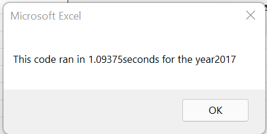
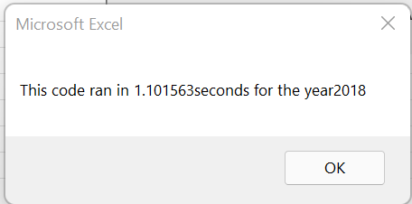
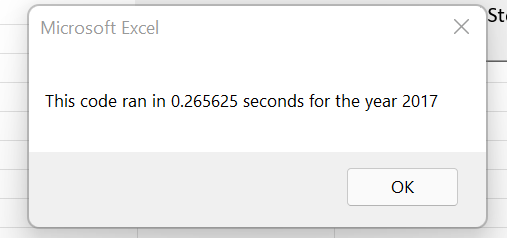
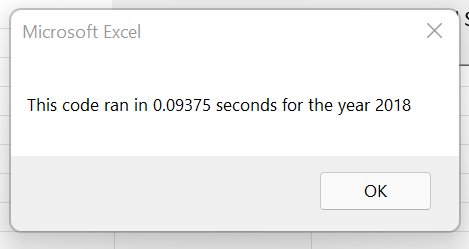

# Stock Analysis with VBA

## Overview of Project
The purpose of this project is to help a client advise his parents on stock investments. 
Stocks were taken for the years 2017 and 2018 to determine how often a particular stock
was traded in a single day. A return percentge was also calculated to determine how well a 
stock did within that year. From this information, the client will be able to help their
parents make an informed decision on which stocks to invest in.

## Results
### Stock Findings
From 2017 to 2018, there is a visible decline in the return percentage for the 12 stocks
provided. In 2017, there was only one stock that had a negative return percentage; by 2018, 
10 out of the 12 stocks had a negative return percentage. There were only two stocks who
did not have a negative return percentage in 2018. Those being ENPH whose percentage dropped
from 129.5% to 81.9% and RUN, whose return percentage increased from 5.5% to 84%. Which,
actually showcases that RUN had the best return from 2017 to 2018.
### Code Comparison
The original code used the first time to receive the stock analysis ran at a much slower rate
than the new, refactored code. For the year 2017, the original code ran in 1.0397 seconds and for
2018, the code ran in 1.101563 seconds.

However, using the refactored code did speed up the amount of time it took to run the analysis.
For the year 2017, the code ran in 0.265625 seconds, while in 2018, the code ran in 0.09375
seconds. 

When comparing the two, in the original code, the year 2017 ran faster than the year 2018.
However, in the refactored code, the year 2018 ran faster than the year 2017.

## Summary
An advantage of refactoring code is that you do not have to start from scratch, you can save time by taking a code
that is already written and tweaking it to perform the exact analysis that you would like. Also, it can be a way
to learn how to code something a more efficient and effective way. On the other hand, refactoring a code can cause
you to run into some errors, since the code was created for a specific outcome. With that being said, it can also 
cause you to spend more time trying to debug a code that was not written for the exact analysis that you had in mind.

There is a detailed statement on the advantages and disadvantages of the original and refactored VBA script 
Witht the VBA script used to perform this analysis, the refactored code made it a lot more to complete more 
complicated functions because there was a blueprint there to use. The original code can be used as a 
reference point to then make the code better. However, the original code was not created to run multiple
analysis within, which is what the refactored was designed to do. It would be much easier to write a small,
simple code in this case, than to refactor a code.
